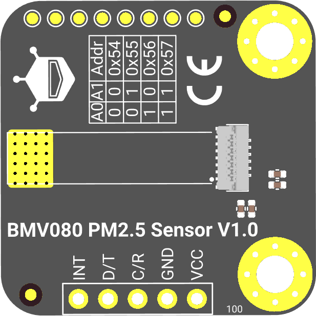
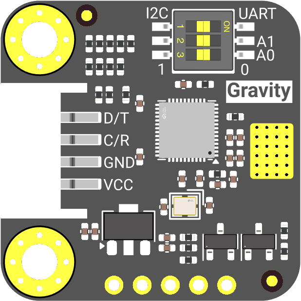

# DFRobot_BMV080_Gravity

* [English Version](./README.md)

这是一个 DFRobot BMV080 Gravity 模块的 Arduino 库，用于读取 PM1.0、PM2.5 和 PM10 颗粒物浓度数据。

这款 BMV080 PM2.5 传感器模块设计紧凑、精度高且测量范围广。其核心采用博世最新研发的 BMV080 传感器元件——全球最小的 PM 空气质量传感器，体积比市场上同类产品小 450 多倍。尽管尺寸大幅缩减，但性能丝毫不减。它不仅能精确测量空气中 PM2.5 颗粒的质量浓度，还支持 PM1.0 和 PM10 的检测。

传统的 PM2.5 传感器通常依靠风扇或风道将自由漂浮的颗粒引入检测区域，因此体积较大，并伴有风扇噪音和灰尘堆积问题，这增加了维护成本和故障风险。而 BMV080 采用类似于相机的测量原理，运用激光光学技术，根据自由空间中颗粒的数量和相对速度来计算质量浓度。它巧妙地利用周围自然气流驱动颗粒进入检测区域进行直接测量，无需风扇或强制气流系统，从而消除了维护麻烦，避免了风扇造成的灰尘堆积，显著提高了设备的可靠性。

BMV080 传感器由模块上的 ESP32 固件管理。本库通过以下两种方式与模块固件通信：

- **I2C** — 短寄存器帧（0xA5 前缀），适合本地短距离通信
- **UART** — 标准 Modbus RTU 协议，适合远距离通信

本库不包含 Bosch BMV080 SDK，也不暴露 `open` 或 `close` API；BMV080 传感器句柄由 ESP32 固件持有。

<p align="center">
  
   &nbsp; &nbsp; &nbsp;
  
</p>

## 产品链接（[https://www.dfrobot.com.cn](https://www.dfrobot.com.cn)）
    SKU: SEN0662

## 目录

* [概述](#概述)
* [库安装](#库安装)
* [方法](#方法)
* [兼容性](#兼容性)
* [历史](#历史)
* [创作者](#创作者)

## 概述

* 该库支持通过 I2C 和 UART Modbus RTU 与 DFRobot BMV080 Gravity 模块通信
* 该库支持连续测量和间歇（duty-cycle）测量两种模式
* 该库支持读取 PM1.0、PM2.5 和 PM10 质量浓度数据
* 该库支持配置测量参数：积分时间、间歇周期、算法选择、遮挡检测、振动滤波
* 该库支持通过 `sData_t` 读取 PM 数据和状态标志
* 该库支持配置 UART 地址、波特率、校验位、停止位（保存到模块 NVS）
* 间歇测量启动时会按 BMV080 SDK 要求使用 `eFastResponse` 算法
* 所有单寄存器读取内置 3 次重试机制，提升通信可靠性

## 库安装

使用此库前，请首先安装依赖库 `DFRobot_RTU`。然后下载库文件，将其粘贴到 `\Arduino\libraries` 目录中，然后打开 examples 文件夹并运行演示。

1. 打开 Arduino IDE
2. 在库管理器中搜索 `DFRobot_BMV080_Gravity`
3. 点击安装

或手动安装：

```bash
git clone https://github.com/DFRobot/DFRobot_BMV080_Gravity.git
```

## 方法

`getData()` 仅在有新的 PM 数据时填充 `sData_t`。`data` 中包含以下字段：

- `PM1`、`PM2_5`、`PM10`：PM1.0、PM2.5、PM10 质量浓度，单位 ug/m3
- `runtime`：传感器运行时间，单位秒
- `runState`：当前固件运行状态，参见 `eRunState_t`
- `status`：最近一次 BMV080 SDK/固件状态码
- `isObstructed`：检测到遮挡
- `isOutsideMeasurementRange`：PM 数值超出可靠测量范围
- `dataReady`：有新的 PM 数据；只有该标志置位时 `getData()` 才返回 `true`
- `measuring`：传感器当前正在测量
- `paramsVerified`：测量参数已应用到传感器
- `valueClamped`：预留兼容标志
- `valueInvalid`：固件检测到非有限 PM/runtime 值并已做安全处理
- `sampleSeq`：样本序号，每产生一次新测量结果递增

```C++

/**
 * @fn begin
 * @brief 检查是否能够与兼容的 BMV080 Gravity 固件通信
 * @return true 通信和兼容性检查成功
 */
virtual bool begin(void);

/**
 * @fn getData
 * @brief 读取 PM 数据。仅在新数据就绪时返回 true。
 * @param data 数据结构指针。成功时填充 PM 浓度、运行时间、运行状态和状态标志。
 * @return true 固件 dataReady 标志已置位，false 无新数据或读取失败
 */
bool getData(sData_t *data);

/**
 * @fn setMeasureMode
 * @brief 设置测量模式并启动测量
 * @details 写入测量模式寄存器和启动动作后，等待固件上报目标运行状态。
 * @param mode eContinuousMode 连续模式 或 eDutyCycleMode 间歇模式
 * @return 0 成功, -1 无效模式, 其他值为通信、读取或固件错误
 * @note 启动间歇测量时，固件会按 BMV080 SDK 要求强制使用 eFastResponse。
 */
int setMeasureMode(eMeasureMode_t mode);

/**
 * @fn stopMeasurement
 * @brief 停止当前 BMV080 测量（action 值 2）
 * @return true 固件接受了该操作
 */
bool stopMeasurement(void);

/**
 * @fn reset
 * @brief 复位 BMV080 并恢复默认配置（action 值 3）
 * @details 固件会停止当前测量、复位 BMV080、恢复默认保持寄存器，并保存这些默认值。
 * @note 默认 UART RTU 地址：0x57；默认 UART 参数：9600 bps，8-N-1。
 *       默认测量参数：eContinuousMode、eBalanced、遮挡检测开启、振动滤波开启、
 *       integrationTime 10.0 秒、dutyCyclingPeriod 30 秒。
 *       如果 reset 前修改过 UART 通信参数，reset 后或模块重启后需按恢复后的默认参数重新连接。
 * @return true 固件接受了该操作
 */
bool reset(void);

/**
 * @fn setIntegrationTime
 * @brief 设置测量积分时间
 * @param integration_time 积分时间（秒）
 * @note 在 duty-cycle 模式下，dutyCyclingPeriod 必须至少为 integrationTime + 2 秒。
 *       本接口会按当前 dutyCyclingPeriod 校验；如果要把 integrationTime 调大到超过当前周期余量，
 *       需要先调用 setDutyCyclingPeriod() 调大周期，再调用 setIntegrationTime()。
 * @return 0 成功, -1 无效值, 其他值为固件错误
 */
int setIntegrationTime(float integration_time);

/**
 * @fn setDutyCyclingPeriod
 * @brief 设置间歇测量周期
 * @param duty_cycling_period 间歇周期（秒）
 * @note 周期必须至少为当前 integrationTime + 2 秒。如果之后修改积分时间，
 *       启动间歇测量前需要继续保持该关系有效。如果要缩短周期，应先按需要降低 integrationTime。
 * @return 0 成功, 其他值为固件错误
 */
int setDutyCyclingPeriod(uint16_t duty_cycling_period);

/**
 * @fn getIntegrationTime
 * @brief 读取测量积分时间
 * @return 积分时间（秒），读取失败返回 NAN
 */
float getIntegrationTime(void);

/**
 * @fn getDutyCyclingPeriod
 * @brief 读取间歇测量周期
 * @return 间歇周期（秒），读取失败返回 0
 */
uint16_t getDutyCyclingPeriod(void);

/**
 * @fn setObstructionDetection
 * @brief 启用或禁用遮挡检测
 * @param enable true 启用, false 禁用
 * @return true 固件接受了该值
 */
bool setObstructionDetection(bool enable);

/**
 * @fn getObstructionDetection
 * @brief 读取遮挡检测设置
 * @return 1 已启用, 0 已禁用, -1 读取失败
 */
int getObstructionDetection(void);

/**
 * @fn setVibrationFiltering
 * @brief 启用或禁用振动滤波
 * @param enable true 启用, false 禁用
 * @return true 固件接受了该值
 */
bool setVibrationFiltering(bool enable);

/**
 * @fn getVibrationFiltering
 * @brief 读取振动滤波设置
 * @return 1 已启用, 0 已禁用, -1 读取失败
 */
int getVibrationFiltering(void);

/**
 * @fn setMeasurementAlgorithm
 * @brief 设置 BMV080 测量算法
 * @param measurement_algorithm eFastResponse、eBalanced 或 eHighPrecision
 * @return 0 成功, -1 无效值, 其他值为固件错误
 * @note 占空比测量会按照 BMV080 SDK 要求由固件强制使用 eFastResponse
 */
int setMeasurementAlgorithm(eMeasurementAlgorithm_t measurement_algorithm);

/**
 * @fn getMeasurementAlgorithm
 * @brief 读取 BMV080 测量算法
 * @return eFastResponse、eBalanced、eHighPrecision，读取失败返回 0
 */
eMeasurementAlgorithm_t getMeasurementAlgorithm(void);

/**
 * @fn setUartAddress
 * @brief 保存 UART Modbus RTU 从机地址到模块 NVS
 * @note 新的 UART 地址在模块以 UART 模式重启后生效；重启后需使用新地址重新连接。
 * @param addr UART Modbus RTU 从机地址，有效范围 0x01 到 0xF7；0x00 是 Modbus 广播地址，不允许使用。
 * @return uint8_t 0 成功, 其他值为参数、通信或固件错误
 */
uint8_t setUartAddress(uint8_t addr);

/**
 * @fn getUartAddress
 * @brief 读取 UART Modbus RTU 从机地址
 * @return 当前 UART Modbus RTU 从机地址，读取失败或寄存器值无效返回 0
 */
uint8_t getUartAddress(void);

/**
 * @fn setBaud
 * @brief 保存 UART 波特率设置到模块 NVS
 * @note 新的波特率在模块以 UART 模式重启后生效
 * @param baud 参见 eBaud_t 枚举
 * @return uint8_t 0 成功, 其他值为通信或固件错误
 */
uint8_t setBaud(eBaud_t baud);

/**
 * @fn getBaud
 * @brief 读取 UART 波特率
 * @return 波特率 (bps)，读取失败返回 0；无效寄存器值默认为 9600
 */
uint32_t getBaud(void);

/**
 * @fn setUartFormat
 * @brief 保存 UART 校验位和停止位设置到模块 NVS
 * @note 新的 UART 格式在模块以 UART 模式重启后生效
 * @param parity 参见 eParity_t 枚举
 * @param stopBit 参见 eStopBit_t 枚举，默认为 eStopBit1
 * @return uint8_t 0 成功, 其他值为通信或固件错误
 */
uint8_t setUartFormat(eParity_t parity, eStopBit_t stopBit = eStopBit1);

/**
 * @fn getUartFormat
 * @brief 读取 UART 校验/停止位寄存器
 * @return 高字节为校验位，低字节为停止位，读取失败返回 0
 */
uint16_t getUartFormat(void);
```

库开发调试时，可取消 `src/DFRobot_BMV080_Gravity.h` 中 `ENABLE_DBG` 的注释，内部失败路径会通过 `DBG` 打印错误码。

使用 `setUartAddress()` 可保存新的 UART Modbus RTU 地址；模块以 UART 模式重启后，在 `DFRobot_BMV080_Gravity_UART` 构造函数中传入新地址。

## 示例

- `continuousRead`: 连续测量和 PM 数据读取示例。演示 `begin()`、`setMeasureMode()`、`getData()`、`sData_t` 字段。
- `continuousInterrupt`: 连续测量 + 外部中断。演示通过 BMV080 INT 引脚触发中断来读取数据。
- `dutyCycleRead`: 间歇测量和参数配置示例。演示 `setIntegrationTime()`、`setDutyCyclingPeriod()`、算法和滤波设置，以及 `setMeasureMode()`。
- `dutyCycleInterrupt`: 间歇测量 + 外部中断。演示在周期性测量模式下使用中断驱动的数据采集。
- `configUart`: UART 地址、波特率、校验位和停止位配置示例。演示 `setUartAddress()`/`getUartAddress()`、`setBaud()`/`getBaud()`、`setUartFormat()`/`getUartFormat()`。

## 兼容性

| MCU                | 正常 | 异常 | 未测试 | 备注 |
| ------------------ |:----:|:----:|:------:| ---- |
| Arduino uno        |  √   |      |        |      |
| Mega2560           |  √   |      |        |      |
| Leonardo           |  √   |      |        |      |
| ESP32              |  √   |      |        |      |
| ESP8266            |  √   |      |        |      |
| FireBeetle M0      |  √   |      |        |      |
| micro:bit          |  √   |      |        |      |
| Raspberry Pi 4B    |  √   |      |        |      |

## 历史

- 日期 2026-06-09
- 版本 V1.0.0

## 创作者

Written by thdyyl<yuanlong.yu@dfrobot.com>, 2026. (Welcome to our website)
